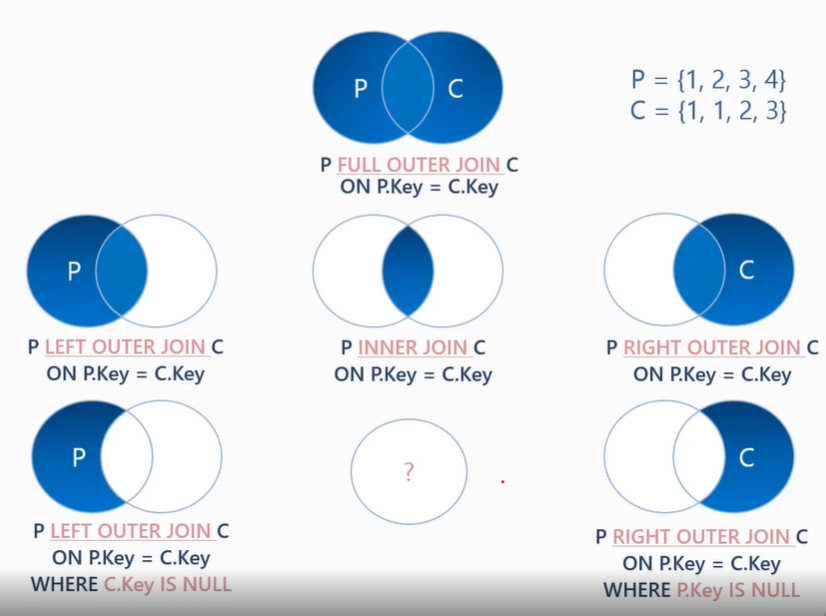

# 조인의 배경, 목적, 유형 ..
1. 조인의 배경
    - 정규화라는 모델링 과정을 거쳤기 때문
    - 중복된 데이터를 제거하여 I/O를 줄여야 함으로 정규화
    - 처리되는 데이터를 줄이고자 정규화
      - 조인을 하는 이유는 다른 테이블이 필요한 컬럼이 있는 것 때문인데
      - 이것의 성질이 SELECT 절에서 필요한 컬럼인지 WHERE 절에서
      - 필요한 컬럼인지에 따라 그 내용도 달라진다.

2. 조인의 목적
    - 분리된 열 재결합
      - 정규화로 인한 분리된 열이 "결과집합"에 필요한 경우
    - 행 복제
      - 중복 행 생성 (N * M)
    - 일치 행 검색과 결합
      - 불 일치 행 제거(INNER JOIN)
    - NULL 값 생성
      - 차집합 포함(OUTER JOIN)

3. 조인 연산
    - LEFT OUTER JOIN
    - INNER JOIN
    - RIGHT OUTER JOIN

4. CROSS JOIN
    - 결과 집합
	- Cartesian Product
	(N * M, 양쪽 입력 전체 행의 곱)  
	행 단위로 집합을 복제
	ex) t1 : 3건, t2 : 10건 -> 총 30건
    - 조인 조건
	- (명시적으로) 없음
	- (물리적으로) 양쪽 입력의 행 * 행
    - 사용 예
	1. 비 관계 열 기준 복제
	ex) 제품 총 편균가 대비 각 제품 단가 별 편차
	2. 전체 행 복제(행을 원하는 수 만큼 복제)
	ex) 소계(Subtotal) 출력

5. INNER JOIN
    - 결과 집합
	- 교집합 (중복허용)
	- 행복제, 열결합 
	  - (1:M, N:M)
    - 조인 조건
	- 복제할 행에 대한 식별조건
	- Equi(=) or Non-Equal(<, >, IN, LIKE, etc.)

6. OUTER JOIN
    - 결과 집합
	- 차집합 + 교집합
	  - 교집합은 INNER JOIN
	  - 차집합은 NULL값 열로 결합
    - 조인조건
	- 교집합에 대한 조건
	  - (주의) 검색 조건과 구별
    - 참고
	- Q) 조인 순서에 영향?
	  - 불필요한(잘못된) OUTER JOIN 사용 비 권장
    - 예제
	1. 교집합 + 차집합
	2. NULL 값 생성 이해
	3. FULL OUTER JOIN 이해

