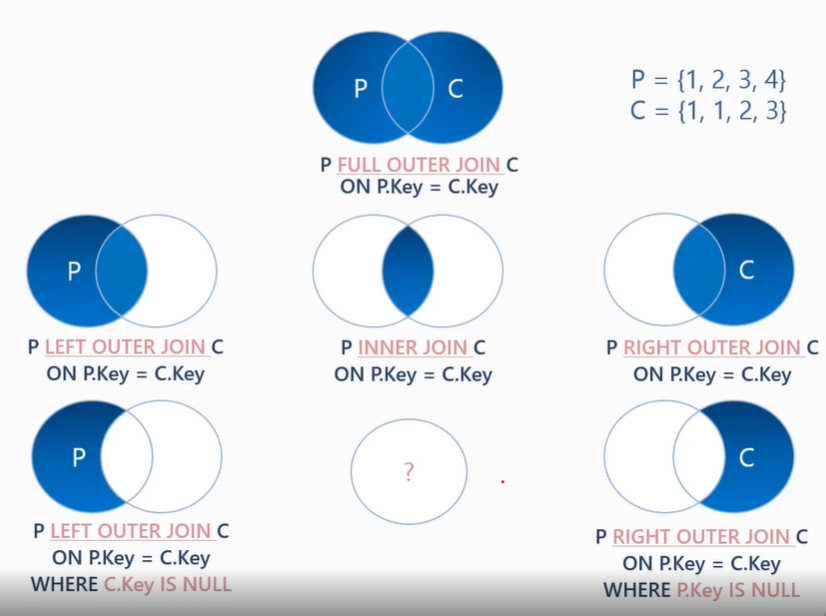

# 조인의 배경, 목적, 유형 ..
1. 조인의 배경
    - 정규화라는 모델링 과정을 거쳤기 때문
    - 중복된 데이터를 제거하여 I/O를 줄여야 함으로 정규화
    - 처리되는 데이터를 줄이고자 정규화
      - 조인을 하는 이유는 다른 테이블이 필요한 컬럼이 있는 것 때문인데
      - 이것의 성질이 SELECT 절에서 필요한 컬럼인지 WHERE 절에서
      - 필요한 컬럼인지에 따라 그 내용도 달라진다.

2. 조인의 목적
    - 분리된 열 재결합
      - 정규화로 인한 분리된 열이 "결과집합"에 필요한 경우
    - 행 복제
      - 중복 행 생성 (N * M)
    - 일치 행 검색과 결합
      - 불 일치 행 제거(INNER JOIN)
    - NULL 값 생성
      - 차집합 포함(OUTER JOIN)

3. 조인 연산
    - LEFT OUTER JOIN
    - INNER JOIN
    - RIGHT OUTER JOINs
